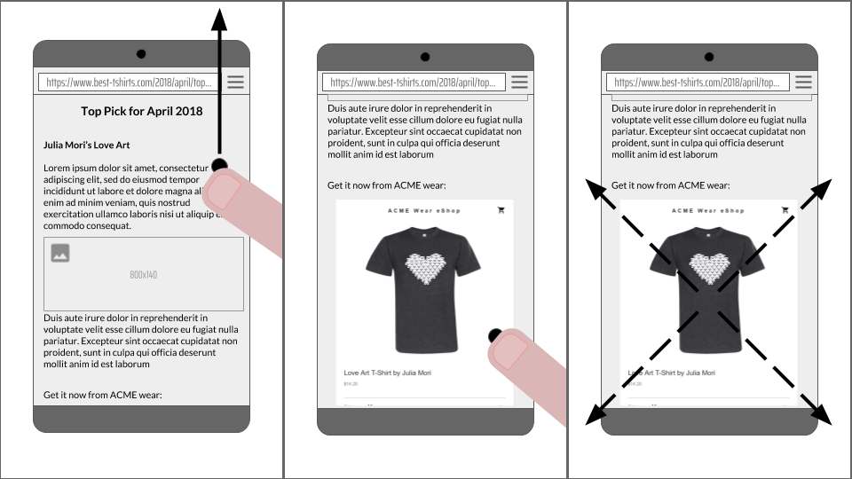
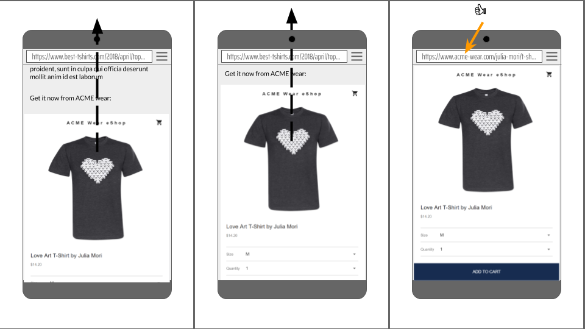

# Portals
**Published:** 2018-04-25, **Updated:** N/A

The name Portals is tentative and the proposal is very early stages. Feedback wanted!



## tl;dr:
This is a proposal for enabling seamless navigations between sites or pages. In particular, this proposal enables a page to show another page as an inset and perform a seamless transition between an inset state and a navigated state.

A document can include an element which renders a document loaded in a portal context:

```html
<portal id="myPortal" src="https://www.example.com/"></portal>
```

Like a frame, you can use `postMessage` to communicate with a document loaded in a portal context.

Unlike a frame, a portal can be *activated*, which causes the top-level browsing context to navigate, replacing its document with the portal.

```js
myPortal.activate({ data: [...] });
```

At this point, the user will observe that their browser has navigated to `https://www.example.com/`. The document receives an event when it is activated. It can use this event to receive data from its *predecessor* (the document which previously occupied the tab), and even move it into a portal context.

```js
window.addEventListener('portalactivate', e => {
  let predecessor = e.adoptPredecessor(document);
  console.assert(predecessor instanceof HTMLPortalElement);
  document.body.appendChild(predecessor);
});
```

### Goals

Enable seamless navigations:
 - from a page showing a portal-aware destination as an inset
 - between pages of a portal-aware website

### Non-goals

We consider the following items out-of-scope:
 - Specifying navigation patterns, e.g. carousel, infinite lists. UX patterns come and go, we don’t want to hinder innovation or spend time on a pattern that might become obsolete in a couple of years.
 - Specifying transitions or defining APIs related to transitions: the proposal assumes that existing animations and DOM manipulations are enough to create compelling user experiences. We might discover important gaps but these should be addressed via separate efforts to avoid overly specific solutions.
 - Hosting arbitrary unmodified web pages with guarantees of privacy and performance. While we are interested in allowing the embedder to apply additional restrictions to a document in a portal context, we anticipate that pages may require modification to work in such modes. Chrome's experience with prerendering suggests that solving this transparently would be very difficult.

## Alternatives considered
### iframe promotion
Iframe promotion is the idea of providing an API for promoting an iframe to become the top document. 

A while ago, Chromium engineers [experimented](https://bugs.webkit.org/show_bug.cgi?id=32848) with such feature but it was eventually [removed](https://bugs.webkit.org/show_bug.cgi?id=81590) because it turned into a source of security issues and added significant complexity to the code base.

Implementing it today in Chrome would still be extremely complex and run against many hidden assumptions throughout the code base. We believe that this would again lead to a constant stream of security bugs. Also, it seems extremely likely that this feature would be tricky and problematic in other browsers for similar reasons.

### fullscreen iframe
The idea here is to make an iframe appear as if it were the main document and reflect that state in the address bar. Concretely, the proposal suggested to extend requestFullscreen with the ability to opt into showing more system and browser UI which would allow iframes to use the whole viewport. There were several concerns with this approach, in particular having the main document still active while one of its iframe is shown “fullscreen” was seen as problematic.

## References
 - [Promotable Iframe (WICG discussion)](https://discourse.wicg.io/t/proposal-for-promotable-iframe/2375/11)

## Acknowledgements
Contributions and insights from: Domenic Denicola, Jake Archibald, Jeffrey Yasskin, Jeremy Roman, Lucas Gadani, Ojan Vafai, Rick Byers, Yehuda Katz (@wycats).
