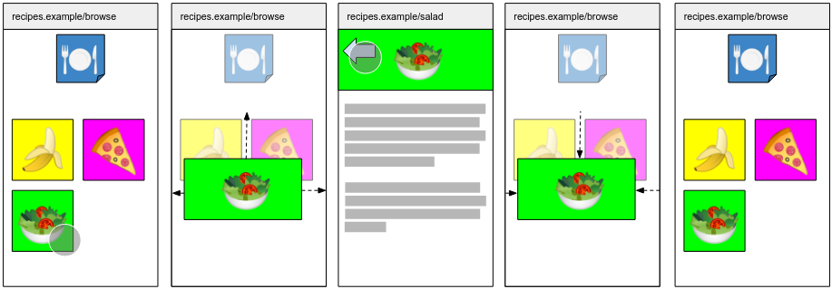
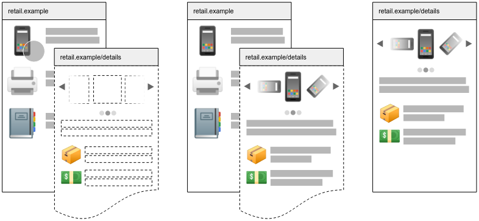
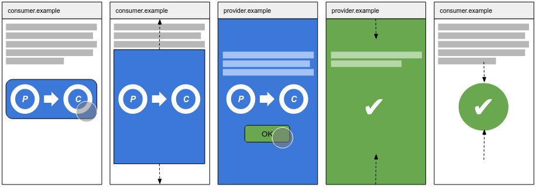
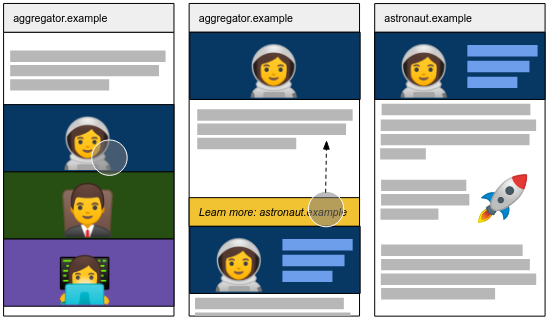

# Key scenarios

This is a list of scenarios which we hope portals will help solve. It includes desired privacy behavior not covered in the [v0 explainer](explainer.md).

## Seamless transitions in a multi-page application



A multi-page application could use Portals to create a smooth and seamless transition amongst its pages.

In this example, a recipe browsing site loads recipe pages and embeds a narrow view of them as tiles in a browsing page.
When the user clicks on the salad option, the application animates the `<portal>` element to fill the screen (possibly
applying a fade or other transition to other elements of the document) and then activates it, at which point the browser
chrome displays the URL of the salad recipe.

If the recipe page has kept the browse page alive by using the `adoptPredecessor` API, then when the user clicks a
"back" button in the application, the recipe page activates the browse page again, which reverses the animation to
return the salad recipe page to a tile. In this case, the recipe page does not present the browse page visibly to
the user, but attaches it the document so that it remains alive while the recipe page is active.

The browse and recipe pages both maintain their full state as this happens. Authors are expected to take care in how
much content they preload. In this case, authors might load the preview image needed to populate the tile and simple
content that might be needed immediately (e.g. recipe text), but defer the loading of more heavy resources (for example,
a video of how to prepare the recipe) until the user has selected a particular recipe to load.

## Partial preloading in a multi-page application



A multi-page application could use Portals to provide faster loading of next page the user visits.

In this example, a retailer is presenting a list of products to a customer. Though the retailer may not know which
product the customer will select, they do know that the customer is likely to select some product and navigate to
a product detail page.

So after the listing page loads, it loads a template of the product details page in a hidden `<portal>` (depicted
above with a dashed outline). The template can prepare the layout and load scripts, images and other resources that
will be needed for all detail pages.

When the user selects a product (for example, a mobile phone), the site populates the detail page with the particulars
of that product (loading product images and descriptions, using `history.replaceState` to update the URL, etc), and
then activates the portal to show the detail page to the user.

## Third-party authorization or transaction flow



Two applications can use Portals to coordinate a smooth transition through an authorization or transaction flow.

In this example, `consumer.example` has embedded a fragment of an authorization page provided by `provider.example`.

When the user clicks, `consumer.example` animates the fragment to fill the screen and activates it. `provider.example`
adopts the `consumer.example` page so that it can maintain its state, and displays a prompt for the user to consider
the authorization request and decide whether to authorize it. The browser chrome displays `provider.example` (since
it has become the top-level page), so the user can have confidence that any credentials they must present are being
delivered to the correct origin.

When the user completes the flow, the provider activates the page from `consumer.example` once again (passing along
structured serializable data which describes the outcome of the flow), which performs an animation to remove the
provider page and update its interface to reflect the result of the flow. It has maintained its state throughout
(and was available to post messages back and forth with the `provider.example` page).

## Pre-navigation preview in a content aggregator



A site that aggregates or indexes content from publisher sites can use Portals to provide a preview of the original
web page and suggest that the user view the original page for full information.

In this example, `aggregator.example` provides an image and summary snippet from several publishers. The user
selects an image of an astronaut from an article on `astronaut.example` and is presented with a short snippet
and a previewed version of the original document presented in a `<portal>` at the bottom of the screen.

If the user is interested in learning more, they swipe the preview upward. When it fills most of the screen,
the aggregator snaps the scroll and activates the `astronaut.example` portal. Since the document has already
loaded, the change to the original publisher page is fast and seamless. The browser chrome updates to reflect
the fact that they have left the aggregator site and arrived at the article about astronauts.

## Carousel of articles from different websites
A news aggregator wants to provide its users the ability to quickly navigate between articles from various publications that cover the same news story.

A typical UX would consist of:
 - A navigation UI at the top of the viewport to convey where you are in the sequence of articles. May disappears and reappears as a user scroll down or back-up.
 - An article which occupies the rest of the viewport and allows for vertical scrolling
 - Left/Right swipe gestures to navigate between the previous/next article.

Requirements:
 - The address bar of the UA is updated to reflect the URL of the article a user has navigated to.
 - Navigations between next/previous articles happen seamlessly.
 - The Navigation UI is kept in sync with where the user is in the sequence of articles.
 - A publisher only get to know about a user when they swipe to an article from said publisher.
 - When a swipe gesture is completed, the news aggregator wants to communicate to the user that they are reading content from a specific publisher by showing the appropriate URL, thereby maintaining user expectations vis-a-vis their privacy.

After being activated, a portal opened by the news aggregator will now receive the input events. This means that it will have to co-operate with the news aggregator in order to maintain the desired user experience. For instance, here is how this could work:
 - The news aggregator becomes a portal of the activated article.
 - The activated article would include a provided script to let the news aggregator detect any swipe gestures and communicate to its portal.

```
<TODO sample code demonstrating how the API can be used to solve the use case>
```

publisher.com/articles/2018/05/monthly-trends...
```
[...]
// tentative approach
window.addEventListener('portalactivate', e => {
  let predecessor = e.adoptPredecessor(document);
  console.assert(predecessor instanceof HTMLPortalElement);
  // by special dispensation, this element keeps the portal alive for the duration of the portalactivate event
  // past that, the author must attach it to the document

  // maintain the user's expectations vis-a-vis the news aggregator flow
  // by keeping the news aggregator's UI around in the form of a portal
  document.getElementById("extUI").appendChild(predecessor);

  // add script to forward swipe gestures to the news aggregator (portal)
  [...]
});
```

## Publication with an infinite list of articles
A web publication wants to offer an infinite list of articles but without having to redesign their website which is architectured as a Multi Page App. The desired UX is as follows:
 - As a user reaches the end of an article, they are presented with a sneak peek of a related article.
 - If they scroll further, the full article is then displayed and the address bar is updated since they have now moved on to a new document. Scrolling back would result in returning to the previous state.

Requirements:
 - The web publication wants to avoid complex changes to their website. They would like to achieve this UX by using a third party service, i.e. copy-pasting a pre-configured snippet.

```
<TODO sample code demonstrating how the API can be used to solve the use case>
```

### Product page inset on a review site
A web publication wants to make it easier to purchase the products it reviews.

The web publication would like to achieve the following UX:
 - At the end of a product review, have an inset showing a preview of the relevant product page from a reputable e-commerce website,
 - When the user tries to interact with the product page, perform a seamless navigation by expanding the inset until it takes over the full viewport, then navigate to the product page.

Requirements:
 - Preserve the reader’s privacy. The e-commerce website should only know that the reader is interested in the product if they decide to interact with the product page inset.
 - Seamless transition from the inset state to the navigated state.
 - Allow the reader to understand/confirm that they are on the reputable e-commerce website after the transition ends by showing the correct URL in the address bar.


```
<TODO sample code demonstrating how the API can be used to solve the use case>
```

## Same-origin seamless navigations
A Multi Page Application would like to achieve navigations that are comparable with those of a Single Page Application.

```
<TODO sample code demonstrating how the API can be used to solve the use case>
```
